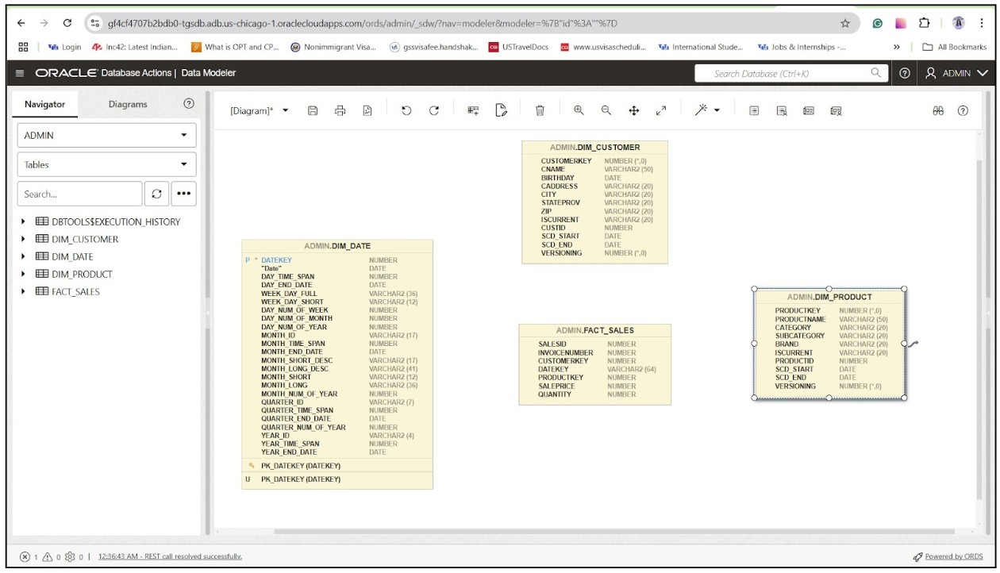
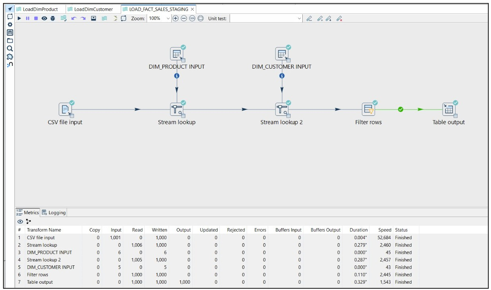
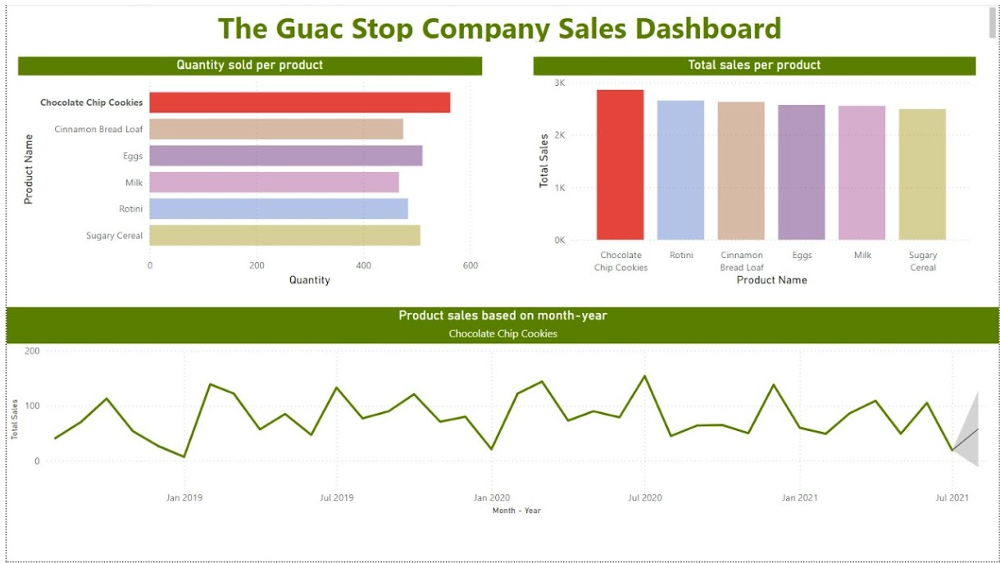

# Data Wareshouse and Power BI for Business Insights

### Business Overview
There is a multinational retail organization that primarily sells fresh produce and groceries. A data warehouse was required to mainly track sales and gain insights.
(As this is an academic project the scope of business was limited and hence the details further would be limitted to the scope)

### Database Warehouse Schema

Note: This database warehouse doesnot have any foreign key constraints between the dimensions and the fact table.  This is because adding foreign keys adds overhead to the process. When there is a foreign key between two tables, and data is inserted in the parent table, the database checks whether the foreign key is present in the child table. This acts as an additional process to insert the data into the database. When the ETL process runs for a huge number of rows this acts as a major overhead and slows down the process.

### ETL Pipeline using Apache Hop
The ETL pipeline takes in excel sheets and inserts/updates the records in the database warehouse accordingly.

### Power BI dashboard to gain business insights

The dashboard shows the quantity sold per product and total sales per product. From these charts, we observe that chocolate chip cookies are the most sold product and have the highest sales. Below is the sales prediction for Choco chip cookies and it is bound to increase in the next month hence investing more in promotion for chocolate chip cookies will help increase sales and revenue.
